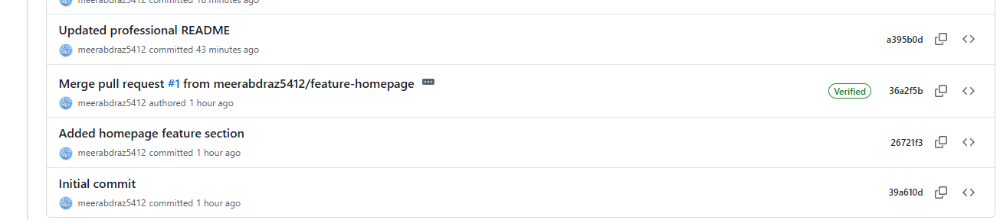

# 🌿 Version Control Workflow Project


> **Task 01 — DevAlpha Internship**
> A professional Git and GitHub version control workflow demonstrating industry-standard branching strategies, pull requests, and collaborative development practices used in real-world DevOps environments.

---

## 📋 Table of Contents

- [Overview](#overview)
- [Objectives](#objectives)
- [Tools Used](#tools-used)
- [Project Structure](#project-structure)
- [Step-by-Step Workflow](#step-by-step-workflow)
- [Branch Strategy](#branch-strategy)
- [Workflow Diagram](#workflow-diagram)
- [Key Outcomes](#key-outcomes)
- [Project Screenshots](#project-screenshots)
- [How to Clone & Run](#how-to-clone--run)
- [Internship Task Tracker](#internship-task-tracker)
- [Author](#author)

---

## 🔍 Overview

This project demonstrates a complete **professional Git workflow** from repository initialization to feature development and pull request merging. Every step follows the industry-standard practices used by real DevOps and software development teams worldwide.

The project includes:
- A fully tracked Git repository with **8 commits**
- A clean **feature branch** workflow
- A successfully **merged Pull Request**
- Professional **documentation** and **screenshots** as proof of work

---

## 🎯 Objectives

- ✅ Implement Git-based version control from scratch
- ✅ Use feature branches for isolated development
- ✅ Create and merge Pull Requests following code review practices
- ✅ Maintain a clean, professional commit history
- ✅ Document the workflow for portfolio presentation

---

## 🛠️ Tools Used

| Tool | Purpose |
|------|---------|
| **Git** | Local version control and commit tracking |
| **GitHub** | Remote repository hosting and collaboration |
| **HTML** | Web application developed as the project content |
| **GitHub Pull Requests** | Code review and branch merging |

---

## 📁 Project Structure

```
version-control-workflow/
│
├── screenshots/
│   └── merged-pull-request.png    # Proof of merged PR
│
├── index.html                      # Main web application
└── README.md                       # Project documentation
```

---

## 📌 Step-by-Step Workflow

### Step 1 — Initialize Local Repository
Created a new local Git repository to begin tracking project files and version history.
```bash
git init
```

### Step 2 — Create GitHub Repository
Set up a remote repository on GitHub and connected it to the local repository.
```bash
git remote add origin https://github.com/meerabdraz5412/version-control-workflow.git
```

### Step 3 — Commit Initial Project Files
Added all project files to the staging area and made the first commit with a clear message.
```bash
git add .
git commit -m "Initial commit"
```

### Step 4 — Push Code to GitHub
Pushed the local commits to the remote GitHub repository for cloud-based storage and collaboration.
```bash
git push -u origin main
```

### Step 5 — Create Feature Branch
Created a dedicated feature branch to develop new functionality without affecting the stable main branch.
```bash
git checkout -b feature-homepage
```

### Step 6 — Develop & Commit Feature
Developed the homepage feature on the isolated branch and committed changes with descriptive messages.
```bash
git add .
git commit -m "Add homepage feature section"
```

### Step 7 — Push Feature Branch to GitHub
Pushed the feature branch to GitHub to make it available for pull request creation and review.
```bash
git push origin feature-homepage
```

### Step 8 — Create Pull Request
Opened a Pull Request on GitHub to propose merging the feature branch into main, following collaborative review practices.

> GitHub → New Pull Request → feature-homepage → main

### Step 9 — Review & Merge ✓
Reviewed the Pull Request, confirmed no conflicts existed, and successfully merged the feature branch into the main production branch.

> ✅ Pull Request #1 — Merged Successfully

---

## 🌿 Branch Strategy

### Main Branch
- Contains **production-ready** code only
- Never developed on directly
- Only receives merges from reviewed and approved feature branches
- Always remains **stable and deployable**

### Feature Branch — `feature-homepage`
- Created from main for **isolated development**
- New features developed independently without risk to main
- Merged back into main via a **Pull Request** after review
- Deleted after successful merge to keep the repo clean

---

## 🔄 Workflow Diagram

```
Developer
    │
    ▼
git init + git remote add origin
    │
    ▼
Initial Commit → Push to main
    │
    ▼
git checkout -b feature-homepage
    │
    ▼
Develop Feature → Commit Changes
    │
    ▼
git push origin feature-homepage
    │
    ▼
Open Pull Request on GitHub
    │
    ▼
Code Review
    │
    ▼
✅ Merge to Main Branch
```

### Branch Flow Visualization

```
main           ──────────────────────────────────▶ (stable)
                    │                        ▲
                    │                        │
feature-homepage    └──── commit ── commit ──┘
                         (develop)         (PR merged ✓)
```

---

## 🏆 Key Outcomes

| Skill | Description |
|-------|-------------|
| **Git Repository Management** | Initialized and managed a full Git repo with clean commit history |
| **Feature Branching** | Applied industry-standard feature branch workflow |
| **Pull Requests** | Created, reviewed, and merged a PR following professional practices |
| **Remote Collaboration** | Pushed and synced code between local and remote repositories |
| **Commit Discipline** | Maintained descriptive, meaningful commit messages across 8 commits |
| **Documentation** | Produced professional README and workflow documentation |

---

## 📸 Project Screenshots

### ✅ Merged Pull Request



> Pull Request successfully merged from `feature-homepage` into `main` branch — confirming a clean, conflict-free merge with full commit history preserved.

---

## 🚀 How to Clone & Run

```bash
# Clone the repository
git clone https://github.com/meerabdraz5412/version-control-workflow.git

# Navigate into the project folder
cd version-control-workflow

# Open the project in your browser
open index.html
# OR on Windows:
start index.html
```

To explore the branch history:
```bash
# View all branches
git branch -a

# View commit history
git log --oneline --graph --all
```

---

## 📊 Internship Task Tracker

| Task | Project | Difficulty | Status |
|------|---------|------------|--------|
| **Task 01** | Version Control Workflow | Beginner | ✅ Completed |
| **Task 02** | CI/CD Pipeline with GitHub Actions | Easy | ✅ Completed |
| **Task 03** | Containerization Project | Intermediate | 🔄 In Progress |

---

## 👩‍💻 Author

**Meerab Draz**
DevOps Engineer Intern @ DevAlpha

📧 meerabdraz5412@gmail.com
🔗 [LinkedIn](https://www.linkedin.com/in/meerab-draz5412/)
🐙 [GitHub](https://github.com/meerabdraz5412)
🌐 [Portfolio](https://meerabdraz5412.github.io/portfolio)

---

*Built with ❤️ as part of the DevAlpha DevOps Internship Programme*
